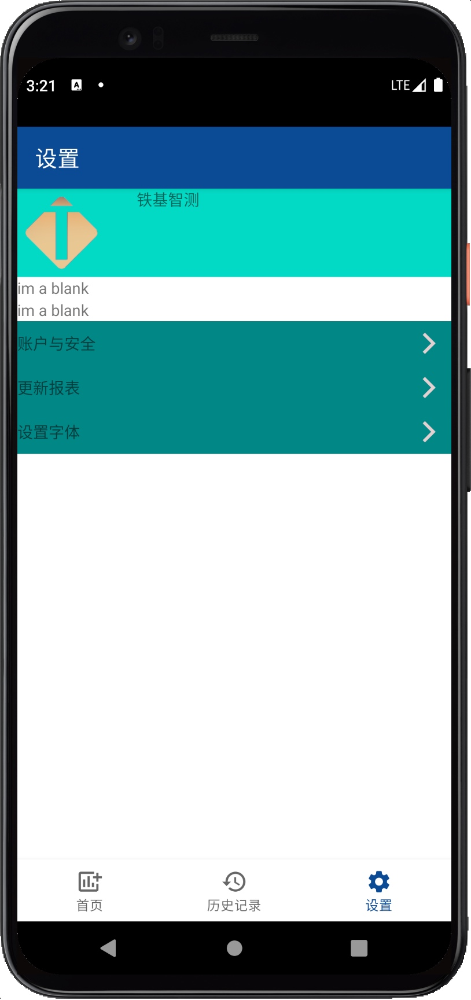
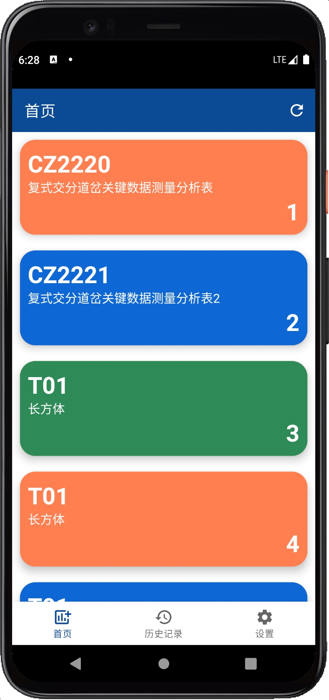
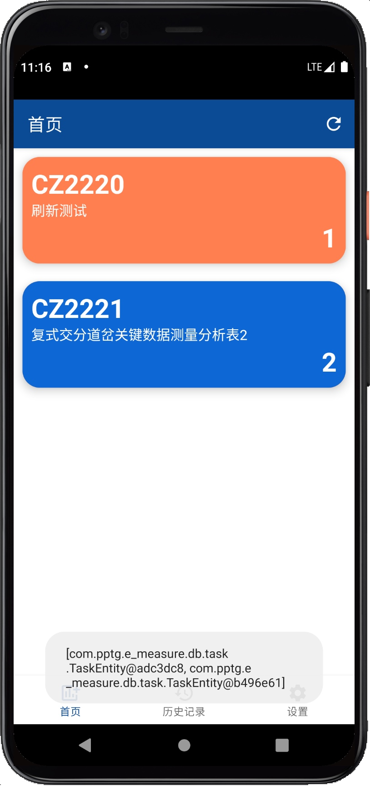
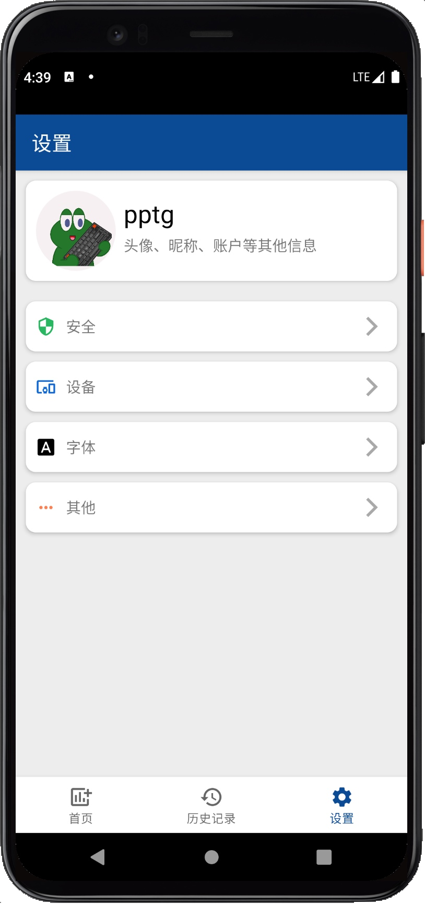
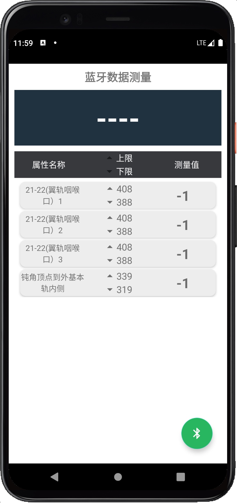
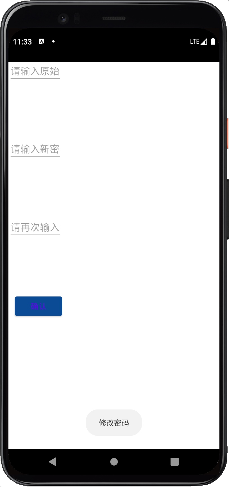

# E_Measure
铁基智测Android端从Java -> Kotlin的美吱吱更新,JAVA版部分界面如下

## 一、开发日志
### 22.7.2
1. 简单登陆界面, eolink Mock
2. 登陆密码的显示/隐藏, LOGO

### 22.7.3
1. 选择Mock软件
    1. ~~postman不能满足多个example的需求~~
    2. ~~eolink的response的json不能嵌套array~~
    3. 选择了ApiFox，能满足大部分需求而且是中文
2. Api地址:https://www.apifox.cn/apidoc/shared-00b6acc0-98ab-4c93-98b6-13f36c3d8ac4

### 22.7.4
1. 合并登陆跳转和主目录
2. 实现远程任务报表合并
3. 添加导航页

### 22.7.5
1. 使用ROOM初步配置数据库结构
2. 在线读取、离线存储数据表

3. 搞点颜色瞧瞧

### 22.7.6
1. 创建设置界面逻辑及UI

### 22.7.7
1. Material一下

2. 添加刷新功能，有冗余部分，明天处理下

### 22.7.8
1. 设置页面的大进步

### 22.7.9
1. 合并网络和数据库的公共部分
2. 添加项目结构文档
3. 配置Mock和正式网络

### 22.7.10
1. 完成修改密码Demo
2. 完成数据报表详细内容Demo
3. 配置正式环境的数据报表(数据库没接上，只能点未刷新前2个）

## 二、项目结构
1. bean：各种基础的bean
2. db：数据库相关
    1. base：共用基础部分
    2. history：历史记录
    3. task：数据报表
    4. DBManager.kt：数据库管理单例
3. network：网络相关
    1. response：对bean的结构进一步构造
    2. ApiNet.kt：定义网络POST和GET接口
    3. ServiceCreator.kt：创建网络单例
4. ui：各种页面
    1. home：首页页面
    2. dashboard：历史记录页面
    3. settings：设置页面
    4. login：登陆页面
5. utils：工具类
    1. ViewResSetter：扩展view的填充tint功能，用来为图片着色
6. view：自定义view
    1. EMRoundImageView：自定义的圆角图片
7. EMApplication.kt：存储全局信息，网络、数据库和Context等
8. MainActivity.kt：主Activity
9. MainViewModel.kt：记录主Activity的munu在不同fragment下是否显示