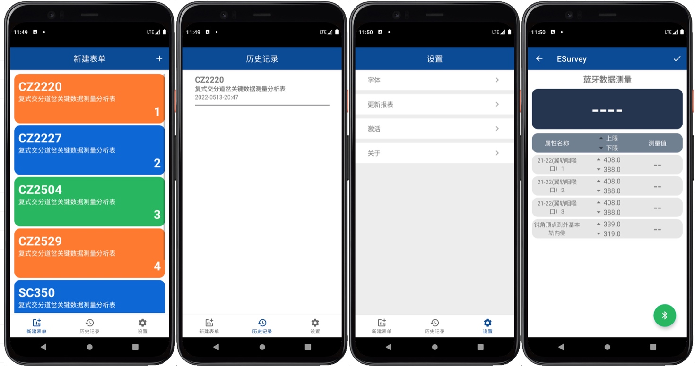
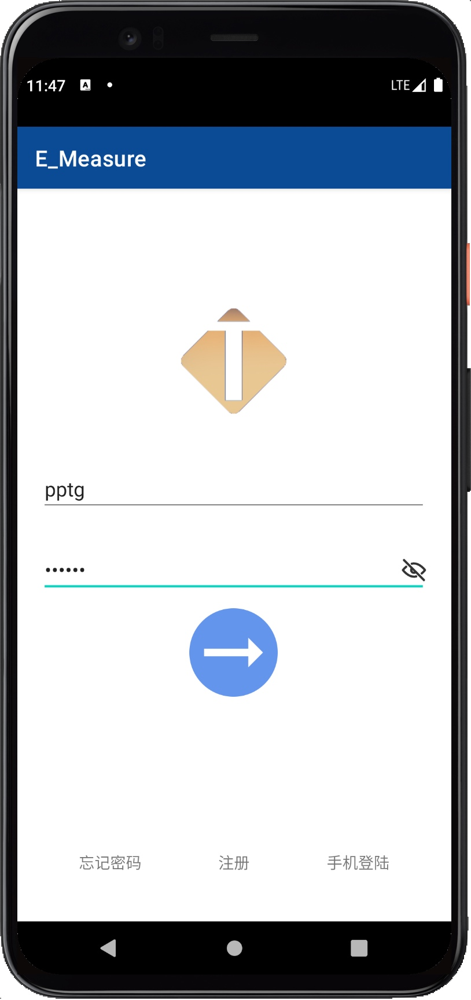
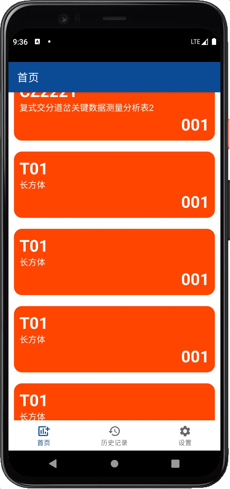
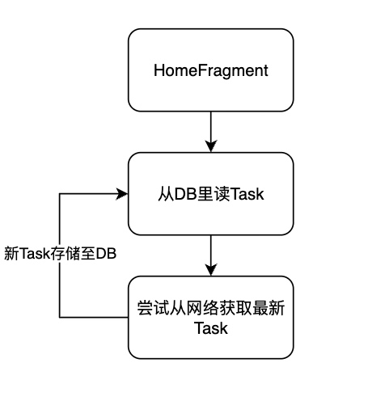
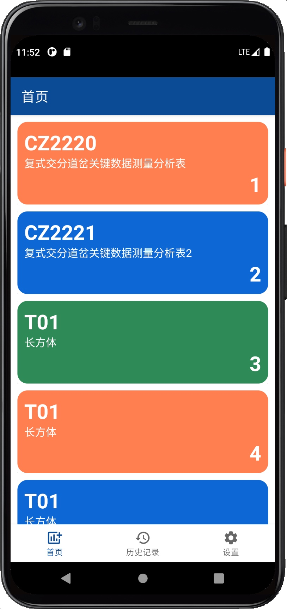

# E_Measure
铁基智测Android端从Java -> Kotlin的美吱吱更新,JAVA版部分界面如下

## Day01
1. 简单登陆界面, eolink Mock
2. 登陆密码的显示/隐藏, LOGO

## Day02
1. 选择Mock软件
    1. ~~postman不能满足多个example的需求~~
    2. ~~eolink的response的json不能嵌套array~~
    3. 选择了ApiFox，能满足大部分需求而且是中文
2. Api地址:https://www.apifox.cn/apidoc/shared-00b6acc0-98ab-4c93-98b6-13f36c3d8ac4

## Day03
1. 合并登陆跳转和主目录
2. 实现远程任务报表合并
3. 添加导航页

## Day04
1. 使用ROOM初步配置数据库结构
2. 在线读取、离线存储数据表

3. 搞点颜色瞧瞧

